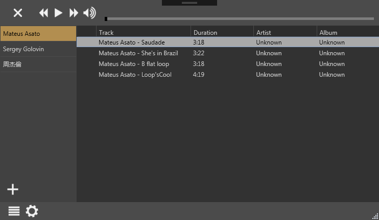

# MPLite
A simple music player written in C# (.NET 4.0) with a built-in scheduler.

## Screenshots

## TODO
- [x] Rearrange tracks by dragging
- [x] Multiple trigger event (For special task, like the class bell. It needs to be tiggered multiple time in a day.)
- [ ] Smoothly volume control
- [x] Window for showing event info
- [ ] Remote control (through mobile phone)

## Awesome librarys this project used
- [Jarloo.Calendar](http://www.jarloo.com/wpf-calendar-control/)
- [Json.NET (NewtonSoft.Json)](http://www.newtonsoft.com/json)
- [Itenso.Windows.Controls.ListViewLayout](https://www.codeproject.com/Articles/25058/ListView-Layout-Manager)
- [Calendar.NET](https://www.codeproject.com/Articles/378900/Calendar-NET) `MPLite.Event` is built according to this library.
- [Extended WPF toolkit](http://wpftoolkit.codeplex.com/)
- [GongSolutions.WPF.DragDrop](https://github.com/punker76/gong-wpf-dragdrop)
