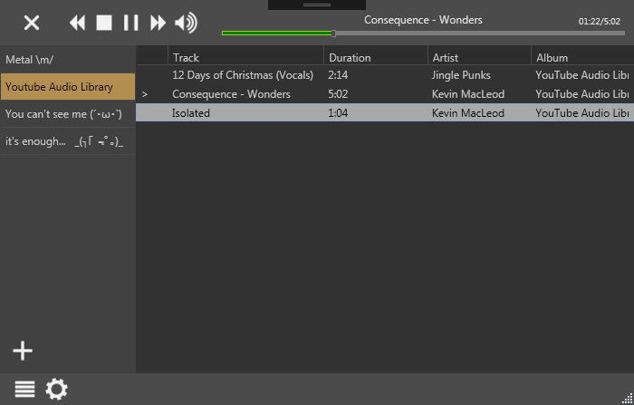
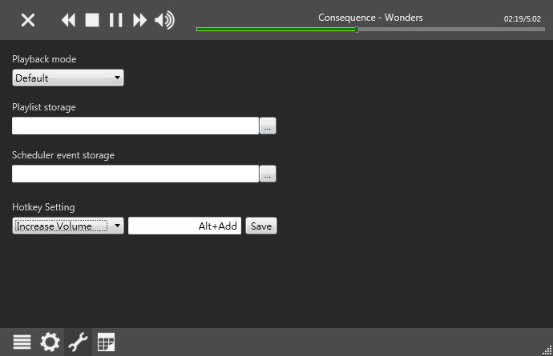
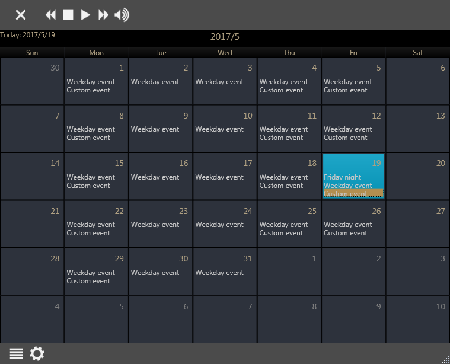
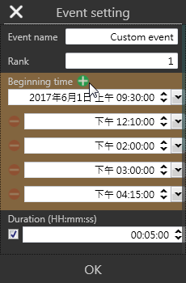
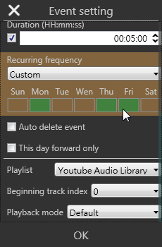

# MPLite
A simple music player written in C# (.NET 4.0) with a built-in scheduler.
(Windows XP SP3 is supported!)

## Screenshots

* Page - Settings

* Page - Calender (scheduler)

* Scheduler event settings
You can set multiple triggering time to a single event, and it also can be set as a custom recurring event.

  

## TODO
- [x] Rearrange tracks by dragging
- [x] Multiple trigger event (For special task, like the class bell. It needs to be tiggered multiple time in a day.)
- [x] Smoothly volume control
- [x] Window for showing event info
- [ ] Remote control (via web page)

## Known issues
- [ ] Soundtrack might not be played if the file path contains Japanese characters.
    - Probably cause: Soundtrack is played via `mciSendString (winmm.dll)`, and Japanese characters cannot be handled.
- [ ] Length of track might not be displayed correctly.
    - Probably cause: File is encoded in VBR (Variable Bit Rate).

## Awesome librarys this project used
- [Jarloo.Calendar](http://www.jarloo.com/wpf-calendar-control/)
- [Json.NET (NewtonSoft.Json)](http://www.newtonsoft.com/json)
- [Itenso.Windows.Controls.ListViewLayout](https://www.codeproject.com/Articles/25058/ListView-Layout-Manager)
- [Calendar.NET](https://www.codeproject.com/Articles/378900/Calendar-NET) `MPLite.Event` is built according to this library.
- [Extended WPF toolkit](http://wpftoolkit.codeplex.com/)
- [GongSolutions.WPF.DragDrop](https://github.com/punker76/gong-wpf-dragdrop)
- [Hardcodet.Wpf.TaskbarNotification](http://www.hardcodet.net/wpf-notifyicon)

## Contributing
Any ideas / PR / bug reports are welcome, and feel free to customize your own music player by forking this repo! :)
